# Hi 👋, I'm Himory Zhang

### A passionate full-stack developer from China

- 🌱 I'm currently learning **How to build an Agent**
- 💬 Ask me about **ANYTHING!!!!**
- 📫 How to reach me: **[himory.zhang@gmail.com](mailto:himory.zhang@gmail.com)**
- ⚡ Fun fact: **I think I'm easy to get along with**
- 📝 I write articles on **[my blog](https://blog.nice2meetu.site/)**

### Connect with me

[GitHub](https://github.com/Himoryzhang) · [X / Twitter](https://twitter.com/HimoryZhang) · [Blog](https://blog.nice2meetu.site/)

### Languages and Tools

**Frontend**

  
  
  
  
  
  
  
  
  

**Backend and Databases**

  
  
  
  
  
  
  
  
  
  

**Data and AI**

  
  

**Tools and Platforms**

  
  
  
  
  
  
  
  
  
  

### Most Used Languages

